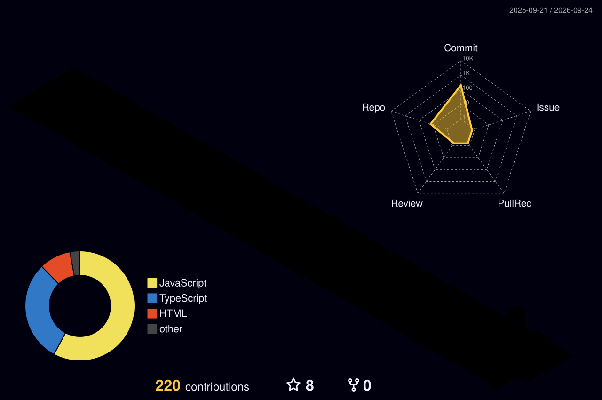

<div align="center">


<br/>


<br/><br/>

<a href="https://saumyportfolio74.netlify.app">

</a>
&nbsp;
<a href="https://github.com/saumypandey745?tab=repositories">

</a>

</div>

---

# ⚡ ENGINEERING PROFILE

<table>
<tr>
<td width="55%" valign="top">

### 👨‍💻 Software Developer

I build **scalable web applications, SaaS platforms, real-time systems and AI-powered products**.

My engineering interests include:

* 🏗️ System & API architecture
* ⚡ Real-time applications
* 🏢 Multi-tenant SaaS
* 🗄️ Database architecture
* 🤖 AI integrations
* 🔐 Application security
* 🚀 Performance & scalability

</td>

<td width="45%" valign="top">

### 🧠 Engineering Mindset

```text
Understand
    ↓
Architect
    ↓
Build
    ↓
Test
    ↓
Optimize
    ↓
Ship
```

**Principles**

`Clean Code`

`Strong Architecture`

`Security First`

`Scalable Systems`

</td>
</tr>
</table>

---

# 🚀 SELECTED SYSTEMS

<table>
<tr>

<td width="50%" valign="top">

## 📞 Nucleus Signal

**Call Intelligence Platform**

Multi-tenant B2B SaaS focused on call tracking, recordings, analytics and AI-powered intelligence.

**Stack**

`React` `Node.js` `Express`

`PostgreSQL` `Prisma` `WebSockets`

`Telnyx` `Deepgram` `ElevenLabs`

</td>

<td width="50%" valign="top">

## 📦 FlexiManage ERP

**Enterprise Management Platform**

Modular ERP architecture covering CRM, inventory, finance, users and RBAC.

**Stack**

`NestJS` `Prisma` `PostgreSQL`

`Redis` `REST APIs`

`RBAC` `Multi-Tenant`

</td>

</tr>

<tr>

<td width="50%" valign="top">

## 🔐 AI Security Assessment

**AI-Powered Security Platform**

Read-only website security assessment and attack-surface analysis platform.

**Stack**

`TypeScript` `Node.js` `React`

`PostgreSQL` `Redis` `BullMQ`

`AI APIs`

</td>

<td width="50%" valign="top">

## 📡 DropX

**Peer-to-Peer Transfer**

Real-time peer-to-peer file transfer system focused on direct device communication and network traversal.

**Stack**

`JavaScript` `WebRTC`

`STUN` `TURN`

`WebSockets`

</td>

</tr>
</table>

---

# 🧰 TECHNOLOGY MATRIX

<div align="center">

### Languages


### Frontend


### Backend


### Database / Infrastructure


### Engineering


</div>

---

# 🌌 3D CONTRIBUTION UNIVERSE

<div align="center">



</div>

---

# 📊 GITHUB ANALYTICS

<div align="center">

<picture>
<source media="(prefers-color-scheme: dark)" srcset="https://github-readme-stats.vercel.app/api?username=saumypandey745&show_icons=true&hide_border=true&theme=tokyonight&rank_icon=github"/>
<source media="(prefers-color-scheme: light)" srcset="https://github-readme-stats.vercel.app/api?username=saumypandey745&show_icons=true&hide_border=true&theme=default&rank_icon=github"/>

</picture>

 

<picture>
<source media="(prefers-color-scheme: dark)" srcset="https://github-readme-stats.vercel.app/api/top-langs/?username=saumypandey745&layout=compact&hide_border=true&theme=tokyonight"/>
<source media="(prefers-color-scheme: light)" srcset="https://github-readme-stats.vercel.app/api/top-langs/?username=saumypandey745&layout=compact&hide_border=true&theme=default"/>

</picture>

</div>

---

# 🔥 CONTRIBUTION STREAK

<div align="center">

<picture>
<source media="(prefers-color-scheme: dark)" srcset="https://streak-stats.demolab.com?user=saumypandey745&theme=tokyonight&hide_border=true"/>
<source media="(prefers-color-scheme: light)" srcset="https://streak-stats.demolab.com?user=saumypandey745&theme=default&hide_border=true"/>

</picture>

</div>

---

# 📈 ACTIVITY

<div align="center">


</div>

---

# 🎯 CURRENT ENGINEERING FOCUS

```text
┌────────────────────────────────────────────────────────────┐
│                                                            │
│  SaaS Architecture        ████████████████████░░  90%      │
│  Backend Engineering     ███████████████████░░░  85%      │
│  Real-Time Systems       ██████████████████░░░░  80%      │
│  AI Integrations         █████████████████░░░░░  75%      │
│  Database Engineering    ██████████████████░░░░  80%      │
│  Security Engineering    ████████████████░░░░░░  70%      │
│                                                            │
└────────────────────────────────────────────────────────────┘
```

---

# 🌐 PORTFOLIO

<div align="center">

<a href="https://saumyportfolio74.netlify.app">

</a>

 

<a href="https://saumy-portfolio.onrender.com">

</a>

</div>

---

<div align="center">

### BUILD · SHIP · SCALE

<br/>


<br/><br/>

**Thanks for visiting my profile.**

</div>


